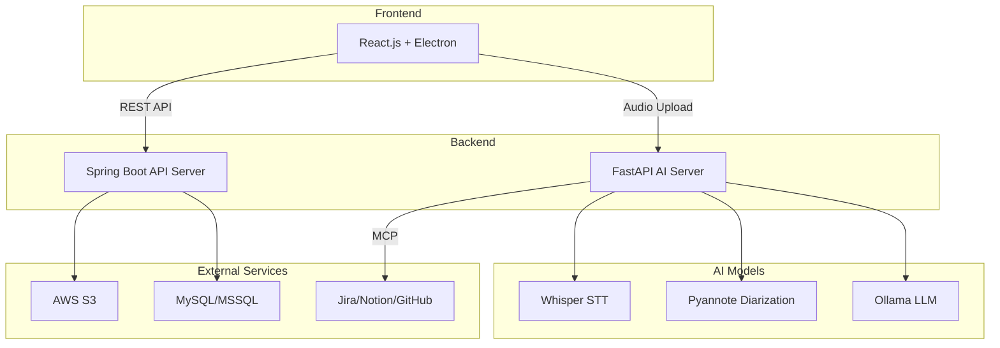

## MINA PROJECT ##

```mermaid
graph TB
    subgraph "Frontend"
        A[React.js + Electron]
    end

    subgraph "Backend"
        B[Spring Boot API Server]
        C[FastAPI AI Server]
    end

    subgraph "AI Models"
        D[Whisper STT]
        E[Pyannote Diarization]
        F[Ollama LLM]
    end

    subgraph "External Services"
        G[AWS S3]
        H[MySQL/MSSQL]
        I[Jira/Notion/GitHub]
    end

    A -->|REST API| B
    A -->|Audio Upload| C
    B --> H
    B --> G
    C --> D
    C --> E
    C --> F
    C -->|MCP| I

```
